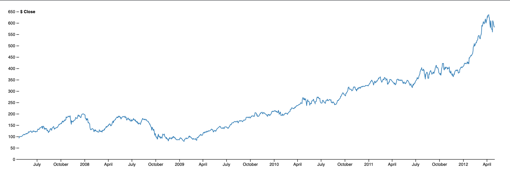

# What is D3.js?
> D3.js is a JavaScript library for manipulating documents based on data. D3 helps you bring data to life using HTML, SVG, and CSS.

That's about it. I would add that it's the most powerful and customizable JavaScript charting library out there right now. You can do virtually anything you want with it.

You can follow this link [D3.js](https://https://d3js.org/) to D3's official website.

But if you are here, I assume you already know what D3, so let's dive straight into the code. Before we being, I should say that I took the example from [here](https://observablehq.com/@d3/line-chart). I decomposed the code and explained each section to ensure that you understand exactly what is going on.

We first load the data using the **csv** method. It returns a promise so we grab the data from within the `then()` method.

```javascript
d3.csv("/data.csv", d3.autoType)
```
`d3.autoType` infers the types of values in the object and coerces them. In our example, we actually want the values to be coerced to **number** type.

You can find more information here [d3.autoType](https://github.com/d3/d3-dsv#autoType).

Next, we transform the raw data to our own format.

```javascript
const data = Object.assign(d.map(v => ({ date: v.date, value: v.value} )), { y: "$ Close" });
```

If you are using ES6, you can destructure it like this -

```javascript
const data = Object.assign(d.map(({ date, close }) => ({ date, value: close } )), { y: "$ Close" });
```

We set some defaults and proceed to create the main **line** charting object. Fairly straightforward stuff here.

```javascript
const height = 400;

const width = 1200;

const line = d3.line()
  .defined(d => !isNaN(d.value))
  .x(d => x(d.date))
  .y(d => y(d.value));

const margin = {
  top: 20,
  right: 30,
  bottom: 30,
  left: 40
};
```
Now, we create the x and y axis.

```javascript
const x = d3.scaleUtc()
  .domain(d3.extent(data, d => d.date))
  .range([margin.left, width - margin.right]);

const y = d3.scaleLinear()
  .domain([0, d3.max(data, d => d.value)]).nice()
  .range([height - margin.bottom, margin.top]);

const xAxis = g => g
  .attr("transform", `translate(0, ${ height - margin.bottom })`)
  .call(d3.axisBottom(x)
    .ticks(width / 80)
    .tickSizeOuter(0));

const yAxis = g => g
  .attr("transform", `translate(${margin.left}, 0)`)
  .call(d3.axisLeft(y))
  .call(g => g.select(".domain").remove())
  .call(g => g.select(".tick:last-of-type text").clone()
    .attr("x", 3)
    .attr("text-anchor", "start")
    .attr("font-weight", "bold")
    .text(data.y));
```

We will cover some of the interesting pieces in the code above.

* `d3.extent` returns the **min** and **max** value of the array.

* `.domain([0, d3.max(data, d => d.value)]).nice()` ensures that the **y axis**'s domain values are rounded off nicely.

* `.call(g => g.select(".tick:last-of-type text").clone()` basically clones the last item in the y-axis.

The rest of the code basically appends the various elements onto the **DOM**.

```javascript
const svg = d3.select("svg")
  .attr("viewBox", [0, 0, width, height]);

svg.append("g")
  .call(xAxis);

svg.append("g")
  .call(yAxis);

svg.append("path")
  .datum(data)
  .attr("fill", "none")
  .attr("stroke", "steelblue")
  .attr("stroke-width", 1.5)
  .attr("stroke-linejoin", "round")
  .attr("stroke-linecap", "round")
  .attr("d", line);
});
```
In the previous section, it looks fairly simple. But you might be wondering - How does the `call()` method work, and who invokes the `xAxis` and `yAxis` functions?

From the documentation -
> Invokes the specified function exactly once, passing in this selection along with any optional arguments. Returns this selection. This is equivalent to invoking the function by hand but facilitates method chaining.

You can find the link here [.call](https://github.com/d3/d3-selection#selection_call).

From the documentation, it is clear that the **specified** function (in this case, **xaxis** and **yAxis**) passed in will be invoked exactly once. The argument **g** is implicitly passed into both functions in case you are wondering.

If you wish to investigate further, check out the source code [here](https://github.com/d3/d3-selection/blob/master/src/selection/call.js).

```javascript
export default function() {
  var callback = arguments[0];
  arguments[0] = this;
  callback.apply(null, arguments);
  return this;
}
```

* `callback.apply(null, arguments)` is responsible for invoking the specified function passed into `call()`.

* `arguments[0] = this` assigns the **svg** object to the first element in the **arguments** array, which means that **g** refers to the **svg** object. How do we know that **this** refers to the svg object? Refer to the execution context of `.call()`. The `append()` method returns the **svg** element with the appended element. Therefore, when we chain `.call()` onto `append()`, the this value refers to the svg element because call() belongs to the svg element created from the append() invokation. If you are still unclear about how this works, you can read up more [here](https://github.com/getify/You-Dont-Know-JS/blob/1st-ed/this%20%26%20object%20prototypes/ch1.md).

Finally, we create a new **path** and pass the **data** into the almost-completed chart via this line of code: `.datum(data)`.

There we have it!

